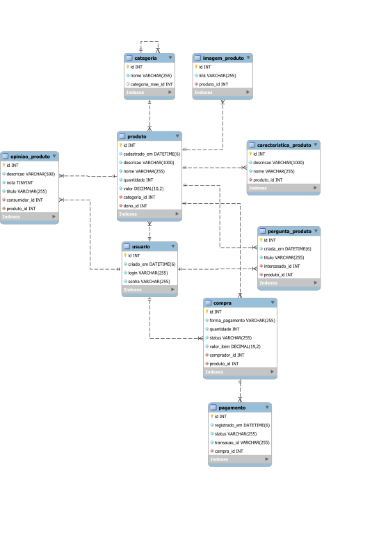

# Desafio Mercado Livre

Esse desafio faz parte do programa de formação [Orange Talents](https://www.zup.com.br/orange-talents/) da [Zup](https://www.zup.com.br/). O objetivo aqui é desenvolver uma REST API que implementa algumas funcionalidades do Mercado Livre.

### O que foi preciso para desenvolver esse projeto
- Java 11;
- [Spring Boot 2.4.4](https://spring.io/projects/spring-boot);
- MySQL 8.
- [Java JWT](https://github.com/jwtk/jjwt);
- [Postman](https://www.postman.com/);

### Tabela de conteúdos
- [Entidades e funcionalidades da API](#entidades-e-funcionalidades-da-API)
  - [Usuário](#usuario)
  - [Categoria](#categoria)
  - [Autenticação de usuário](#autenticacao-de-usuario)
  - [Produto](#produto)
  - [Imagem do Produto](#imagem-do-produto)
  - [Opinião sobre o Produto](#opiniao-sobre-o-produto)
  - [Pergunta sobre o Produto](#pergunta-sobre-o-produto)
  - [Detalhamento de Produto](#detalhamento-de-produto)
  - [Compra](#compra)
  - [Pagamento](#pagamento)
  - [Resumo das funcionalidades da API](#resumo-das-funcionalidades-da-api)
  - [Resumo das operações](#resumo-das-operacoes)
- [Diagrama de entidade e relacionamento](#diagrama-de-entidade-e-relacionamento) 

<a name="entidades-e-funcionalidades-da-API"></a>
## Entidades e funcionalidades da API
<a name="usuario"></a>
### Usuário
#### Informações a serem cadastradas
- login;
- senha;
#### Restrições do cadastro
- O login não poder ser em branco e precisa ser um e-mail;
- O login precisa ser único no sistema;
- O formato do e-mail precisa ser validado;
- A senha não pode ser em branco e precisa ter no mínimo 6 caracteres;
- O instante de cadastro do usuário precisa ser registrado;
#### Cadastro
- POST http://localhost:8080/usuarios
- Corpo da requisição (ex):
  ```yaml
  {
    "login": "exemplo@email.com.br",
    "senha": "exemplo123"
  }
  ```
#### Respostas da API
- Status 200 como resposta de sucesso e JSON;
  - Ex.:
    ```yaml
    {
      "id": 1,
      "login": "exemplo@email.com.br",
      "criadoEm": "2021-04-07T10:34:13.7615381-03:00"
    }
    ```
- Status 400 em falha de validação e JSON:
  - Ex.:
    ```yaml
    {
      "timestamp": "2021-04-07T10:38:45.4393226-03:00",
      "status": 400,
      "errors": [
        {
          "field": "login",
          "message": "não deve estar em branco"
        }
      ]
    }
    ```
<a name="categoria"></a>
### Categoria
No mercado livre você pode criar hierarquias de categorias livres. Ex: Tecnologia -> Celulares -> Smartphones ->
#### Informações a serem cadastradas
- nome;
- possível categoria mãe (não é obrigatório).
#### Restrições do cadastro
- o nome da categoria é obrigatório e precisa ser único.
#### Cadastro
- POST http://localhost:8080/categorias
- Corpo da requisicao (ex):
  ```yaml
  {
    "nome": "Celulares",
    "categoriaMaeId": 1
  }
  ```
#### Respostas da API
- Status 200 como resposta de sucesso;
- Status 400 em falha de validação e JSON:
  - Ex.:
    ```yaml
    {
      "timestamp": "2021-04-07T10:38:45.4393226-03:00",
      "status": 400,
      "errors": [
        {
          "field": "nome",
          "message": "esse nome já está cadastrado"
        }
      ]
    }
    ```
<a name="autenticacao-de-usuario"></a>
### Autenticação de usuário
Nessa etapa configura-se um mecanismo de autenticação via token com o Spring Security e a biblioteca JJWT.  
Na classe de configuração do Spring Security apenas os endpoints /auth e /usuarios estão liberados para acesso sem autenticação. Os demais exigem que um usuário esteja autenticado.
#### Autenticação
- POST http://localhost:8080/auth
- Corpo da requisição (ex):
  ```yaml
  {
    "login": "exemplo@email.com.br",
    "senha": "123456"
  }
  ```
#### Respostas da API
- Status 200 como resposta de sucesso e JSON:
  - Ex.:
    ```yaml
    {
      "tipo": "Bearer",
      "toke": ""eyJhbGciOiJIUzUxMiJ9. ... -NKfwLYgQ"
    }
    ```
- Status 400 em falha de validação e JSON:
  - Ex.:
    ```yaml
    {
      "timestamp": "2021-04-07T10:38:45.4393226-03:00",
      "status": 400,
      "errors": [
        {
          "field": "login",
          "message": "não há usuário cadastrado com o e-mail informado"
        }
      ]
    }
    ```
<a name="produto"></a>
### Produto
#### Informações a serem cadastradas
- nome;
- valor;
- quantidade disponível;
- características:
  - nome;
  - descrição. 
- descrição;
- um produto pertence a uma categoria;
- instante de cadastro.
#### Restrições do cadastro
- nomes de produto e categoria são obrigatórios;
- valor/preço é obrigatório e deve ser >= 0;
- produto tem no mínimo três categorias;
- descrições de produto e categoria têm no máximo 1000 caracteres.
#### Cadastro
- POST http://localhost:8080/produtos
- Corpo da requisição (ex):
  ```yaml
  {
    "nome": "Exemplo produto",
    "valor": "7200.00",
    "quantidade": 700,
    "descricao": "Um produto de exemplo",
    "categoriaId": 1,
    "caracteristicas": [
      {
        "nome": "caracteristica 1",
        "descricao": "descricao 1"
      },
      {
        "nome": "caracteristica 2",
        "descricao": "descricao 2"
      },
      {
        "nome": "caracteristica 3",
        "descricao": "descricao 3"
      }
    ]
  }
  ```
#### Respostas da API
- Status 200 como resposta de sucesso;
- Status 400 em falha de validação e JSON:
  - Ex.:
    ```yaml
    {
      "timestamp": "2021-04-07T10:38:45.4393226-03:00",
      "status": 400,
      "errors": [
        {
          "field": "caracteristicas",
          "message": "tamanho deve ser entre 3 e 2147483647"
        }
      ]
    }
    ```
<a name="imagem-do-produto"></a>
### Imagem do Produto
Um usuário (fazendo papel de vendedor) pode adicionar imagens ao seu produto.  
Nesse caso a imagem não precisa ser de fato salva em alguma cloud.
#### Informações a serem cadastradas
- arquivo de imagem
#### Restrições do cadastro
- usuário só pode adicionar imagem ao seu produto.
#### Cadastro
- POST http://localhost:8080/produtos/{id}/imagens
- Requisição não tem corpo. Pelo Postman você consegue enviar um arquivo selecionando a opção *form-data*.
#### Respostas da API
- Status 200 como resposta de sucesso;
- Status 403 caso tente adicionar imagens a produto que o usuário não é dono e JSON:
  - Ex.:
    ```yaml
    {
      "timestamp": "2021-04-07T10:38:45.4393226-03:00",
      "status": 403,
      "errors": [
        {
          "field": "id",
          "message": "usuário não é dono de 'produto/1'"
        }
      ]
    }
    ```
<a name="opiniao-sobre-o-produto"></a>
### Opinião sobre o Produto
#### Informações a serem cadastradas
- nota;
- título;
- descrição;
- id do usuário que dá a opinião;
- registrar para qual produto a opinião diz respeito.
#### Restrições do cadastro
- nota tem intervalo de 1 a 5;
- título é obrigatório;
- descrição é obrigatória e com no máximo 500 caracteres;
- o usuário é obrigatório;
- o produto é obrigatório.
#### Cadastro
- POST http://localhost:8080/produtos/{id}/opinioes
- Corpo da requisição (ex):
  ```yaml
  {
    "nota": 5,
    "titulo": "Ótimo produto",
    "descricao": "Produto veio bem embalado e ..."
  }
  ```
#### Respostas da API
- Status 200 como resposta de sucesso;
- Status 400 em falha de validação e JSON:
  - Ex.:
    ```yaml
    {
      "timestamp": "2021-04-07T10:38:45.4393226-03:00",
      "status": 400,
      "errors": [
        {
          "field": "descricao",
          "message": "não deve estar em branco"
        }
      ]
    }
    ```
<a name="pergunta-sobre-o-produto"></a>
### Pergunta sobre o Produto
Um usuário pode fazer uma pergunta sobre um produto. O vendedor/usuário daquele produto deve receber um e-mail 
informando que há uma pergunta para o produto que ele está vendendo.  
O e-mail não precisa ser enviado de verdade, apenas um *print* no console já é suficiente.
#### Informações a serem cadastradas
- título;
- instante de criação;
- id do usuário que fez a pergunta;
- registrar para qual produto a pergunta diz respeito.
#### Restrições do cadastro
- título é obrigatório;
- o usuário é obrigatório;
- o produto é obrigatório.
#### Cadastro
- POST http://localhost:8080/produtos/{id}/perguntas
- Corpo da requisição (ex):
  ```yaml
  {
    "titulo": "Exemplo de titulo",
  }
  ```
#### Respostas da API
- Status 200 como resposta de sucesso;
- Status 400 em falha de validação e JSON:
  - Ex.:
    ```yaml
    {
      "timestamp": "2021-04-07T10:38:45.4393226-03:00",
      "status": 400,
      "errors": [
        {
          "field": "id",
          "message": "produto de id '100000' não encontrado"
        }
      ]
    }
    ```
<a name="detalhamento-de-produto"></a>
### Detalhamento de Produto
O front precisa montar uma página com a maior número de informações possíveis sobre o produto.
#### Informações a serem retornadas
- links para as imagens;
- nome do produto;
- preço do produto;
- características do produto;
- descrição do produto;
- média de notas do produto;
- opiniões sobre o produto;
- perguntas sobre o produto.
#### Consulta
- GET http://localhost:8080/produtos/{id}
#### Respostas da API
- Status 200 como resposta de sucesso e JSON:
  - Ex.:
    ```yaml
    {
      "nome": "Exemplo",
      "preco": 120.0
      "quantidade": 400,
      "descricao": "Exemplo de descrição",
      "notaMedia": 5.0,
      "totalDeNotas": 1,
      "caracteristicas": [
        {
          "nome": "característica 1",
          "descricao": "descrição 1"
        },
        {
          "nome": "característica 2",
          "descricao": "descrição 2"
        },
        {
          "nome": "característica 3",
          "descricao": "descrição 3"
        }
      ],
      "imagens": [
        {
          "link": "http://localhost:8080"
        }
      ],
      "opinioes": [
        {
          "nota": 5,
          "titulo": "Em ótimo exemplo",
          "descricao": "uma descricao de exemplo"
        } 
      ],
      "perguntas": [
        {
          "titulo": "Exemplo?",
          "data": "03-03-2021"
        }
      ]
    }
    ```
<a name="compra"></a>
### Compra
Será simulado a integração com um gateway de pagamento, sendo nesse caso o PayPal e o PagSeguro. O fluxo 
geralmente se resume a:
- a nossa API registra uma nova compra e gera um identificador que pode ser passado como argumento para o gateway.
- o cliente efetua o pagamento no gateway;
- o gateway invoca uma url da nossa API, passando o identificador da compra gerado anteriormente pela API e as 
  informações relativas a transação em si.

Espera-se que ao final da compra a API gere um redirect:
- caso pague com PayPal: paypal.com?buyerId={idGeradoDaCompra}&redirectUrl={urlRetornoAppPosPagamento}
- caso pague com PagSeguro: pagseguro.com?returnId={idGeradoDaCompra}&redirectUrl={urlRetornoAppPosPagamento}

Um email é enviado para a pessoa que é dona(o) do produto informando que um usuário realmente disse que queria comprar seu produto.
#### Informações a serem cadastradas
- id do produto;
- id do comprador;
- valor do produto no momento da compra;
- quantidade de itens;
- forma de pagamento: o cliente pode escolher entre pagar com PayPal ou PagSeguro;
- a compra gerada deve ter o status INICIADA;
#### Restrições do cadastro
- quantidade é obrigatória e > 0;
- precisa ter estoque para realizar a compra.
#### Cadastro
- POST http://localhost:8080/produtos/compras
- Corpo da requisição (ex):
  ```yaml
  {
    "produtoId": 1,
    "quantidade": 300,
    "formaPagamento": "PAGSEGURO"
  }
  ```
#### Respostas da API
- Status 200 como resposta de sucesso;
- Status 400 em falha de validação e JSON;
- Status 422 em falta de estoque e JSON:
  - Ex.:
    ```yaml
    {
      "timestamp": "2021-04-07T10:38:45.4393226-03:00",
      "status": 422,
      "errors": [
        {
          "field": "quantidade",
          "message": "não há produtos suficientes no estoque"
        }
      ]
    }
    ```
<a name="pagamento"></a>
### Pagamento
Aqui estamos simulando o gateway fazendo chamadas para a API para registrar pagamentos.  
O gateway pode retornar um pagamento com status de erro e sucesso. O PayPal retorna 1 para sucesso e 0 para erro. O 
PagSeguro retorna as strings SUCESSO e ERRO. Precisamos lidar com esses dois casos no endpoint e a forma mais fácil 
é definir um enum para esse dado de entrada.

Caso o pagamento venha com status de sucesso, deve-se:
- se comunicar com o sistema de notas fiscais, que é outro sistema, passando o id da compra e o id do usuário que fez 
  a compra. Não é necessário criar um sistema para simular isso, apenas uma chamada para um url interna é suficiente;
- se comunicar com o sistema de ranking de vendedores, que também é outro sistema, passando o id da compra e o id do 
  vendedor. Não é necessário criar um sistema para simular isso;
- enviar um e-mail para o usuário comprador avisando da conclusão com sucesso e enviando informações da compra. O 
  e-mail não precisa ser real, apenas um *print* já é suficiente.

Caso o pagamento venha com status de erro, deve-se:
- enviar um e-mail para o usuário comprador informando que o pagamento falhou. Deve-se enviar o link para tentar 
  outro pagamento.
#### Informações a serem cadastradas
- id da compra gerada anteriormente pela API;
- id do pagamento vindo do gateway;
- status do pagamento;
- instante do registro do pagamento na API.
#### Restrições do cadastro
- os ids de compra e pagamento são obrigatórios;
- o id do pagamento proveniente do gateway só pode ser processado uma única vez;
- uma compra não pode ter mais de um pagamento concluído com sucesso associado a ela;
#### Cadastro
- POST http://localhost:8080/produtos/pagamentos
- Corpo da requisição (ex):
  ```yaml
  {
    "compraId": 1,
    "transacaoId": tyoijauhiasu2378nasd,
    "formaPagamento": "SUCESSO"
  }
  ```
#### Respostas da API
- Status 200 como resposta de sucesso;
- Status 400 em falha de validação e JSON:
  - Ex.:
    ```yaml
    {
      "timestamp": "2021-04-07T10:38:45.4393226-03:00",
      "status": 400,
      "errors": [
        {
          "field": "compraId",
          "message": "compra tem um pagamento que já foi processado com sucesso pelo sistema"
        }
      ]
    }
    ```
<a name="resumo-das-funcionalidades-da-api"></a>
### Resumo das funcionalidades da API
- Cadastro de usuário;
- Cadastro de categoria;
- Autenticação de usuário;
- Cadastro de produto e suas características;
- Cadastro de imagens do produto;
- Adição de opinião ao produto;
- Adição de pergunta sobre o produto;
- Consulta de produtos;
- Realização de compra;
- Processamento de pagamentos;
- Integração com sistema de notas fiscais;
- Integração com sistema de ranking de vendedores;
<a name="resumo-das-operacoes"></a>
### Resumo das operações
- POST /usuarios;
- POST /categorias;
- POST /auth;
- POST /produtos;
- POST /produtos/{id}/imagens;
- POST /produtos/{id}/opinioes;
- POST /produtos/{id}/perguntas;
- GET /produtos/{id};
- POST /compras;
- POST /pagamentos;
- POST /notas_fiscais;
- POST /ranking_vendedores;

<a name="diagrama-de-entidade-e-relacionamento"></a>
## Diagrama de entidade e relacionamento

